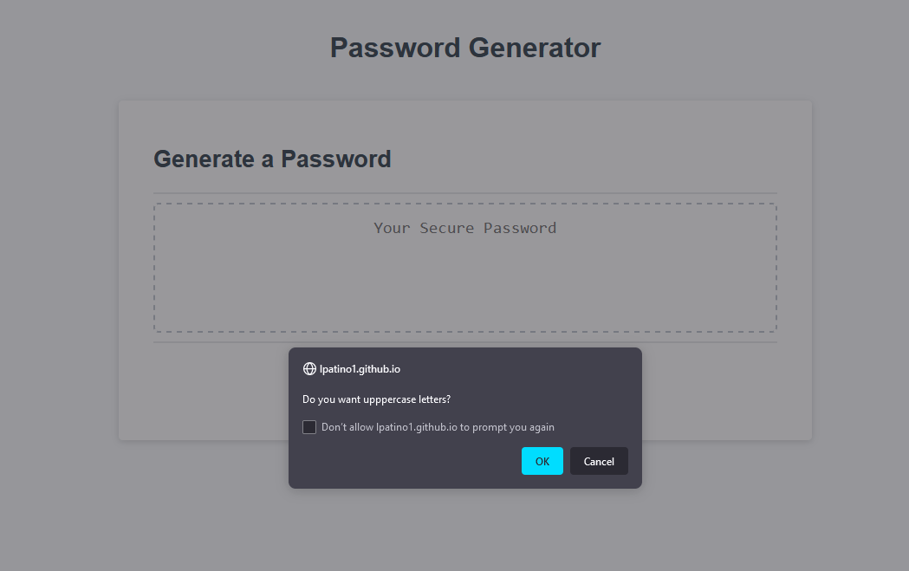

# password-generator

## Description

Using starter code, I wrote the functions that would generate a password from available characters depending on user input. Once a user clicks the "generate password" a prompt box will then guide them through choosing their parameters (e.g., "Do you want numbers in your password?"). Users MUST choose a length between 8 to 128 characters. Users MUST also have letters in their passwords. They can choose between having both uppercase and lowercase letters or just lowercase or uppercase. If users do not choose to have either lowercase or uppercase letters, it will return an error. If users do not input a number, it will return an error. Users will be able to copy their generated password from the website. They will highlight the text and use CTRL+C.

## Installation
No Installation Needed

## Usage
You may run on Visual Studio Code or any other platform.

## Images

## Link to deployed website
https://lpatino1.github.io/password-generator/

## Collaboration
*Followed Henry W. (Teacher Assistants) pseudo code framework.